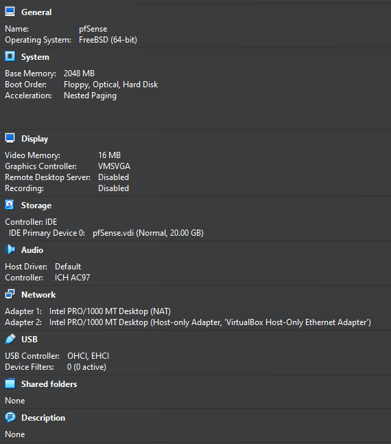
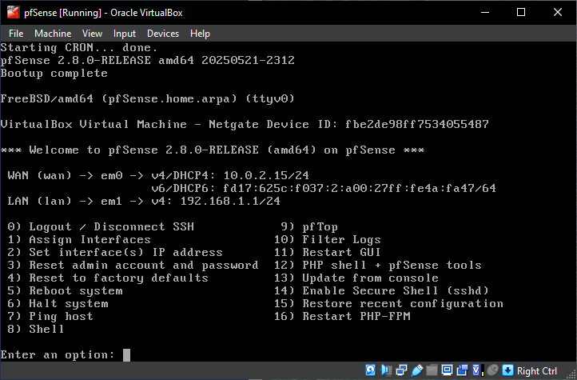
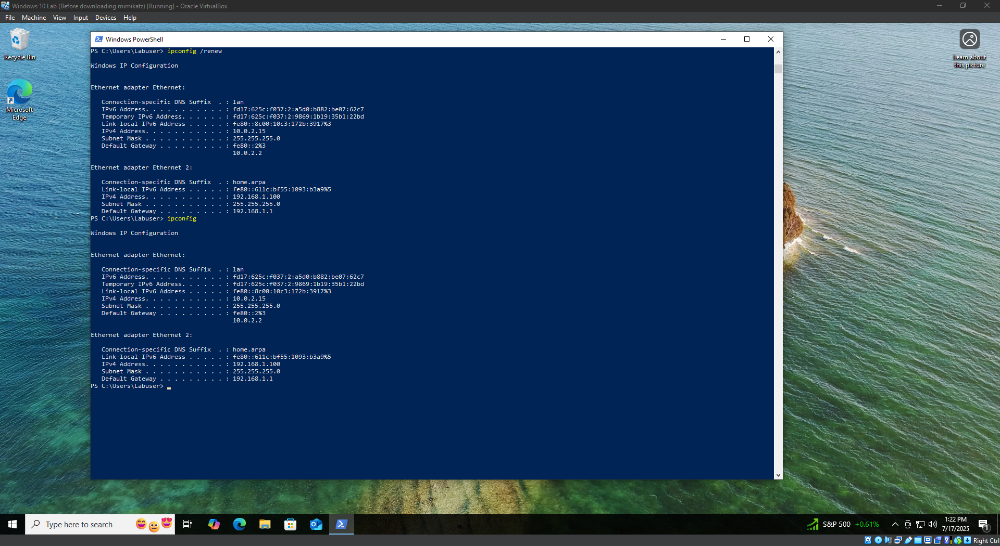
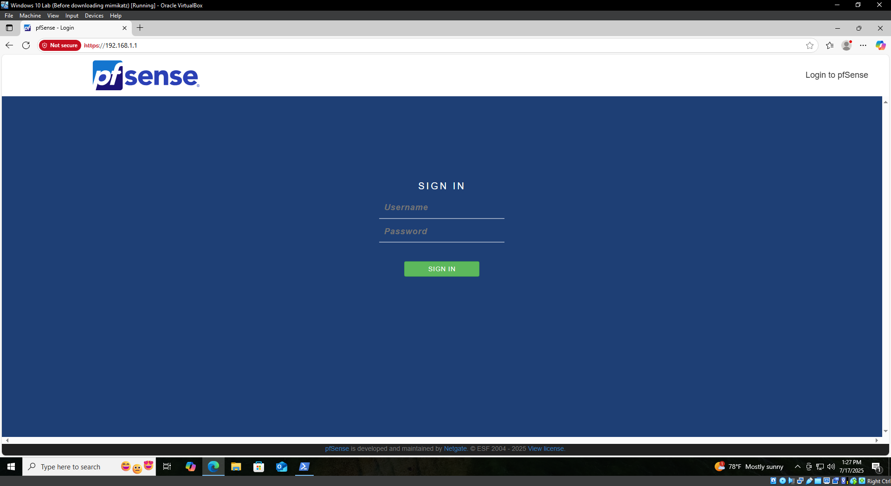
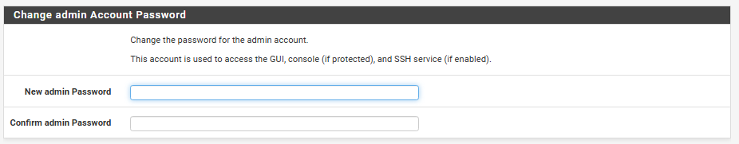
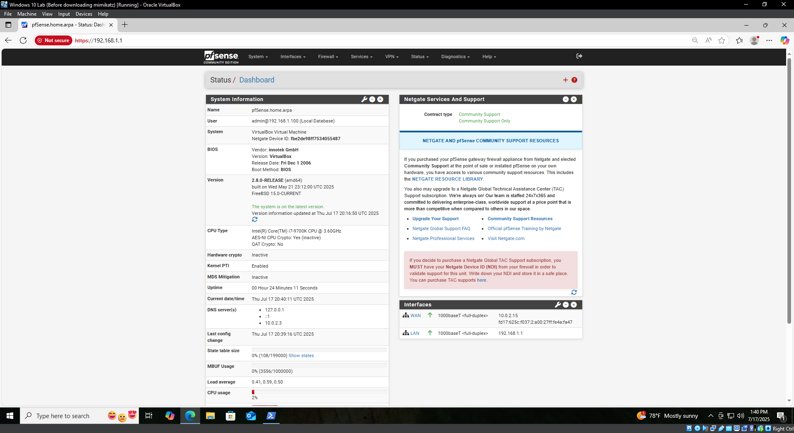
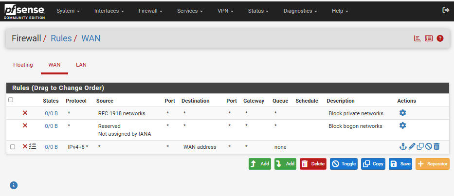
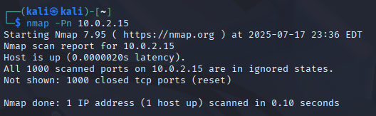
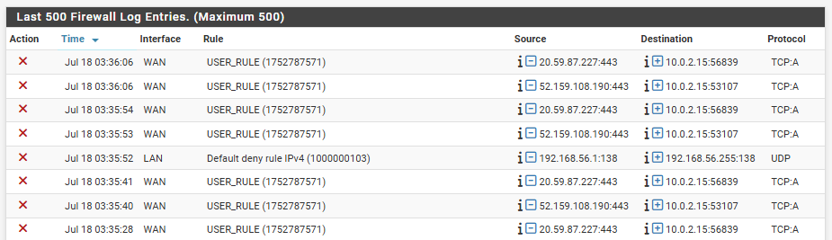

# pfSense Setup & Configuration

## 🎯 Objective

Implement basic firewalling and outbound NAT to allow LAN clients Internet access while blocking unsolicited inbound traffic.

---

## 🗺️ Lab Topology & Resources

* **Host:** VirtualBox on Windows 10 host
* **pfSense VM:** 2 vCPU, 4 GB RAM, 20 GB disk; Adapter 1 = NAT (WAN), Adapter 2 = Host‑only (LAN)
* **Host‑only network:** `vboxnet0` (192.168.1.0/24), built‑in DHCP disabled
* **LAN client VMs:** Windows 10, Kali, Wazuh (each with second adapter on `vboxnet0`)

---

## 🛠️ Environment Preparation

1. **Download ISO**: Latest pfSense CE AMD64 from [pfsense.org/download](https://www.pfsense.org/download/)
2. **Verify SHA256**:

   ```powershell
   Get-FileHash .\pfsense-CE-*.iso -Algorithm SHA256
   ```
3. **Store ISO**: `lab-resources/isos/`

---

## 🖥️ pfSense VM Creation

1. **New VM**: Name `pfSense`, Type **BSD**, Version **FreeBSD (64-bit)**
2. **Memory**: 4096 MB; **Disk**: 20 GB VDI, dynamically allocated
3. **Storage**: Attach ISO to Controller: IDE
4. **Network**:

   * Adapter 1: NAT (WAN)
   * Adapter 2: Host‑only (vboxnet0)

 

---

## ⚙️ Installation & Initial Config

1. **Boot installer**: Select **Install**, accept defaults for keymap and terminal
2. **Partitioning**: Auto (UFS)
3. **Interface Assignment**: `em0 → WAN`; `em1 → LAN`
4. **Set LAN IP**:

   * Address: `192.168.1.1`
   * Mask: `/24`
   * Enable DHCP: `192.168.1.100–200`
5. **Complete install**: Remove ISO, reboot



---

## 🌐 Host‑only Networking Fix

1. **Disable VBox DHCP** on `vboxnet0` via **File → Host Network Manager**
2. **Configure LAN on pfSense** (Console option 2):

   ```
   Select interface: 2 (LAN)
   Configure IPv4 via DHCP? n
   Enter LAN IPv4: 192.168.1.1
   Subnet bit count: 24
   <ENTER> for no gateway
   Configure IPv6 via DHCP6? n
   <ENTER> to keep HTTPS
   Enable DHCP on LAN? y
   Use range: 192.168.1.100–200
   ```
3. **Reboot pfSense** and on Windows VM:

   ```powershell
   ipconfig /renew "Ethernet 2"
   ```

 *Screenshot: `windows_lan_ipconfig.png`*

---

## 🚀 Setup Wizard

1. **Launch Wizard** → **Next**
2. **General Info**:

   * Hostname: `pfsense`
   * Domain: `home.arpa`
   * DNS: `1.1.1.1`
   * Disable DNS override ✓
3. **WAN**: DHCP
4. **LAN**:

   * IPv4: `192.168.1.1/24`
   * DHCP: `192.168.1.100–200`
5. **Skip** optional CARP/IP Alias
6. **Time Zone**: Select region → **Next**
7. **Finish** → Dashboard


 

---

## 📊 Dashboard Verification

* Confirm **WAN** shows a 10.0.2.x address
* Confirm **LAN** is `192.168.1.1`



---

## 🧪 Testing & Verification

1. **Add WAN block rule** (Firewall → Rules → WAN)
2. **Test**:

   * Run `nmap -Pn <WAN_IP>` from Kali
   * Verify ports are filtered
3. **Verify Logs**:

   * **Status → System Logs → Firewall**
   * Confirm blocked entries





---


```
Next Steps

## 6. VPN Setup (Optional)
- OpenVPN or IPsec tunnel
- Client export & connection testing

## 7. IDS/IPS Integration
- Installing Suricata package
- Rule feeds & alert testing

## 8. Monitoring & Logs
- ntopng/darkstat setup
- Sending logs to Wazuh (syslog forwarder)

## 9. Advanced Topics (Optional)
- Multi‑WAN/load balancing
- Captive portal
- High availability

## 10. Lessons Learned & Next Steps
- What worked, what didn’t
- Ideas for expanding the lab
```
