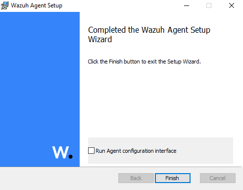
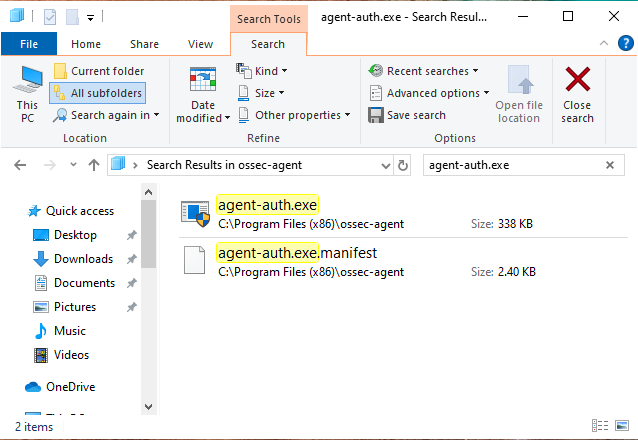

# 📊 Sysmon Log Analysis Lab

> 📝 This project explores Windows event logging using Sysmon to detect and document suspicious activity such as scans, execution of binaries, network connections, DNS queries, file creation, process access, and image loads.

---
<!-- Table of Contents -->
## 📑 Table of Contents

1. [📋 Executive Summary](#executive-summary)  
2. [🎯 Objective](#objective)  
3. [🛠️ Lab Environment](#lab-environment)  
4. [🔄 Forward Sysmon Logs to Wazuh](#forward-sysmon-logs-to-wazuh)  
5. [🛡️ Sigma Detection Rules](#sigma-detection-rules)  
   - [VaultCli Module Load Rule](#vaultcli-module-load-rule)  
   - [Non-System DLL Load Rule](#sysmon-image-load-from-non-system-directory)  
   - [Process Execution from Temp Rule](#process-execution-from-temporary-directory)  
   > _See full Sigma rule definitions in the [sigma/](sigma/) folder_  
6. [🚨 Incident: Non-System DLL Load Detected](#incident-non-system-dll-load-detected)  
7. [🚨 Incident: Mimikatz Credential Dump Detected](#incident-mimikatz-credential-dump-detected)  
8. [✅ Key Takeaways](#key-takeaways)  
9. [📂 Repository Structure](#repository-structure)  
10. [🔗 References](#references)  

---

<a name="executive-summary"></a>
## 📋 Executive Summary

In this lab, I integrated Sysmon on a Windows 10 VM with a Wazuh manager to centralize detailed process and module-load events. I then authored and validated two Sigma rules—one detecting non-system DLL loads and another catching process executions from the Temp directory—and confirmed each end-to-end, including alert generation and Software Restriction Policy blocking. Incident-style write-ups document the detections, evidence, and remediation steps, demonstrating a full SOC workflow: data collection, detection logic, incident analysis, and proactive defense.  

---
<a name="objective"></a>
## 🎯 Objective

To install and configure Sysmon on a Windows 10 virtual machine and analyze logs generated during controlled simulations of common attacker behavior. The goal is to understand how Sysmon enhances visibility into endpoint behavior.

---
<a name="lab-environment"></a>
## 🧪 Lab Environment

- **Windows 10 VM** (Target)  
  - Fresh install with NAT + Host-Only adapters  
  - Sysmon installed with SwiftOnSecurity configuration  
- **Kali Linux VM** (Attacker)  
  - Used to simulate recon and basic attacks (e.g., Nmap scans, file transfer)  
- **Tools Used**  
  - Sysmon  
  - Event Viewer  
  - PowerShell  
  - Python3 (HTTP server on Kali)  
  - ProcDump, PsExec (Sysinternals)  
  - Nmap (optional)

---

## 🔍 Simulated Events and Observations

### 🔹 Process Creation – Calculator (Event ID 1)

```powershell  
Start-Process calc.exe  
```

Sysmon logged this as Event ID 1, capturing `CommandLine`, `ParentProcessName`, and `Hashes`.

#### 📸 Screenshots

  


---

### 🔹 Network Connection – Test-NetConnection (Event ID 3)

```powershell  
Test-NetConnection -ComputerName example.com -Port 80  
```

Logged as Event ID 3, showing `SourceIp`, `DestinationIp`, and `Protocol`.

#### 📸 Screenshots

  


---

### 🔹 DNS Query – Resolve-DnsName (Event ID 22)

```powershell  
Resolve-DnsName microsoft.com  
```

Captured as Event ID 22, with `QueryName`, `QueryResults`, and `DestinationIp`.

#### 📸 Screenshots

  


---

### 🔹 File Creation – Sysmon Test File (Event ID 11)

#### 1) PowerShell File Creation (No Event Logged)

```powershell  
New-Item -Path C:\Users\Public\sysmon_file_lab.txt -ItemType File  
```

**Observation:** No Event ID 11 appeared—indicating the default config filtered out this action.

##### 📸 Screenshots

  


---

#### 2) File Download via Microsoft Edge (Event ID 11)

  


Logged as Event ID 11, capturing `TargetFilename` and `Image`.

---

### 🔹 Process Access – ProcDump to Notepad (Event ID 10)

```powershell  
# Spawn SYSTEM shell via PsExec  
.\PsExec.exe -accepteula -s -i powershell.exe  
# In SYSTEM shell:  
cd C:\Users\Labuser\Downloads  
.\ProcDump.exe -accepteula -ma notepad C:\Temp\notepad.dmp  
```

Logged as Event ID 10, capturing `SourceImage`, `TargetImage`, `GrantedAccess`, and `CallTrace`.

#### 📸 Screenshots

  
  


---

### 🔹 Image Load – CMD Launch (Event ID 7)

```powershell  
Start-Process cmd.exe  
```

Logged as Event ID 7, capturing `ImageLoaded`, `Hashes`, `ImageSize`, and `Signed`.

#### 📸 Screenshots

  


---

## 🧠 Final Observations

### 1. Compare Metadata
- **Common fields:**  
  - `UtcTime`  
  - `ProcessGuid` / `ProcessId`  
  - `Image` / `SourceImage` / `TargetImage`  
- **Unique fields:**  
  - **Event 3 (Network Connection):** `SourceIp`, `DestinationIp`, `Protocol`  
  - **Event 22 (DNS Query):** `QueryName`, `QueryResults`  
  - **Event 11 (File Creation):** `TargetFilename`  
  - **Event 10 (Process Access):** `GrantedAccess`, `CallTrace`  
  - **Event 7 (Image Load):** `ImageLoaded`, `Hashes`, `ImageSize`, `Signed`

### 2. Identify Gaps
- Outbound HTTP requests didn’t always generate Event ID 3 under default rules.  
- Simple PowerShell file creation was filtered out until download actions triggered Event ID 11.  
- No `CallTrace` until enabled in config.  
- `SignatureStatus` missing for some signed images.

### 3. Detection Potential
- **Event 1:** Alert on unknown or unsigned executables.  
- **Event 10:** Alert when `TargetImage=lsass.exe` or high-memory access flags.  
- **Event 22:** Alert on DNS queries to suspicious domains.  
- **Event 7:** Alert on unsigned or uncommon DLL loads in critical processes.

---

### 4. Documentation

#### Event ID 1 – Process Creation
- **Command:** `Start-Process calc.exe`  
- **Timestamp:** 6/17/2025 4:27:43 PM (from EV_ID_1.PNG)  
- **Anomalies:** None

#### Event ID 3 – Network Connection
- **Command:** `Test-NetConnection -ComputerName example.com -Port 80`  
- **Timestamp:** 6/17/2025 4:43:51 PM (from EV_ID_3.PNG)  
- **Anomalies:** None

#### Event ID 22 – DNS Query
- **Command:** `Resolve-DnsName microsoft.com`  
- **Timestamp:** 6/17/2025 4:51:44 PM (from EV_ID_22.PNG)  
- **Anomalies:** None

#### Event ID 11 – File Creation
- **Command:** `New-Item -Path C:\Users\Public\sysmon_file_lab.txt -ItemType File`  
- **Timestamp:** 6/17/2025 4:54:00 PM (approx, from PS_CL_File_creation_1.PNG)  
- **Anomalies:** No Event ID 11 logged for simple PS file creation under default config  
- **Command:** Download ProcDump via Edge  
- **Timestamp:** 6/17/2025 5:02:54 PM (from EV_ID_11.PNG)  
- **Anomalies:** Logged as Event ID 11 by `msedge.exe`

#### Event ID 10 – Process Access
- **Command:**  
  1. `.\PsExec.exe -accepteula -s -i powershell.exe`  
  2. `.\ProcDump.exe -accepteula -ma notepad C:\Temp\notepad.dmp`  
- **Timestamp:** 6/17/2025 5:58:16 PM (from EV_ID_10.PNG)  
- **Anomalies:** None

#### Event ID 7 – Image Load
- **Command:** `Start-Process cmd.exe`  
- **Timestamp:** 6/17/2025 6:43:22 PM (from EV_ID_7.PNG)  
- **Anomalies:** None

---
<a name="forward-sysmon-logs-to-wazuh"></a>
## 📤 Forward Sysmon logs to Wazuh

The following steps have been completed:

1. **Generated agent registration key** on the Wazuh manager (`manage_agents` ID 001), bound to Windows VM IP `192.168.56.102`.  
   
   

2. **Installed the Wazuh agent MSI (v4.12.0-1)** on the Windows VM and registered it using `agent-auth.exe`.  
     
   

3. **Verified `agent-auth.exe`** on the Windows VM by confirming its path:  
   `C:\Program Files (x86)\ossec-agent\agent-auth.exe`.  
   

4. **Started and confirmed** the Wazuh agent Windows service (`WazuhSvc`) was running.  
     
   

5. **Installed Sysmon64** (v15.15.0.0) and loaded the SwiftOnSecurity configuration from:
   `C:\Users\Labuser\Downloads\sysmonconfig-export.xml`.

6. **Updated** the agent’s `ossec.conf` to include the Sysmon EventChannel:

   ```xml
   <localfile>
     <location>Microsoft-Windows-Sysmon/Operational</location>
     <log_format>eventchannel</log_format>
   </localfile>
   ```

7. **Restarted the Wazuh agent service** to apply the new Sysmon settings.  
   

8. **Verified** the agent log shows:
   `INFO: Analyzing event log: 'Microsoft-Windows-Sysmon/Operational'`.
   

9. **Filtered Sysmon events** in the Wazuh Dashboard by:  
- Adding a filter on `rule.groups: sysmon`  
- Adding the `data.win.system.eventID` column to view Event IDs  


---

# 🛡️ Sigma Detection Rules
> _See full YAML in the [sigma/](sigma/) folder_

## Suspicious VaultCli Module Load

```yaml
title: Suspicious VaultCli Module Load
id: b2e7f8d1-1234-4abc-9f00-abcdef123456
status: experimental
description: Detects when VaultCli.dll is loaded into a process, which may indicate credential‐vault manipulation or dumping.
author: Mikey Rondon
date: 2025/06/28
references:
  - https://github.com/SwiftOnSecurity/sysmon-config
tags:
  - attack.credential_access
  - attack.T1555
  - sysmon
logsource:
  product: windows
  service: sysmon
detection:
  selection:
    EventID: 7
  whitelist:
    ImageLoaded|contains:
      - 'C:\\Windows\\System32'
      - 'C:\\Windows\\SysWOW64'
      - 'C:\\Program Files'
      - 'C:\\Program Files (x86)'
  condition: selection and not whitelist
fields:
  - UtcTime
  - Computer
  - Image
  - ImageLoaded
  - ProcessGuid
  - ProcessId
falsepositives:
  - Legitimate system maintenance or Windows updates that may load VaultCli.dll
level: high
```
---

## Sysmon Image Load from Non-System Directory

```yaml
title: Sysmon Image Load from Non-System Directory
id: 12345678-1234-5678-1234-567812345678
status: experimental
description: Detects when Sysmon logs an image-load event (EventID 7) from a directory outside of typical system paths (possible DLL side-loading).
author: Michael Rondon
date: 2025-06-28
references:
  - https://github.com/SwiftOnSecurity/sysmon-config
tags:
  - attack.execution
  - attack.T1574

logsource:
  product: windows
  service: sysmon

detection:
  selection:
    EventID: 7
  whitelist:
    ImageLoaded|contains:
      - 'C:\\Windows\\System32'
      - 'C:\\Windows\\SysWOW64'
      - 'C:\\Program Files'
      - 'C:\\Program Files (x86)'
  condition: selection and not whitelist

falsepositives:
  - Legitimate software loading non-system DLLs (e.g., plugin architectures)

level: medium
```
---

# Incident: Non-System DLL Load Detected

- **Date/Time:** 2025-06-30T17:26:00Z (UTC)
- **Host:** DESKTOP-OM1C5E5 (agent ID 002, 192.168.56.104)
- **Event ID:** 7 (ImageLoaded)
- **Rule:** Sysmon Image Load from Non-System Directory (Sigma ID: 12345678-1234-5678-1234-567812345678)
- **Description:**  
  A Sysmon image-load event was recorded for `C:\Temp\test.dll`, which resides outside of standard Windows system paths. This triggered our custom Sigma rule to detect potential DLL side-loading.
- **Evidence:**
  - 'TargetFilename: C:\Temp\test.dll'
  - 'TargetFilename: C:\Temp\test.dll'

- **File Details:**
  - SHA256: `E7B998CEB45C519E55F8542A4BE0AFD3B5B02DCA5D1E907850D1668822BF334`
  - File description: NT Layer DLL
  - Product name: Microsoft® Windows® Operating System
  - File version: 10.0.19041.5794

---

## Detection: Temp‐Directory Execution Blocked

- **Detection Rule:** Sysmon Process Execution from Temporary Directory  
  (Sigma ID: e8f1a2b3-4c5d-6e7f-8a9b-0c1d2e3f4a5b)
- **Evidence:**  
  ```text
  TargetFilename: C:\Users\Labuser\AppData\Local\Temp\notepad.exe
  win.system.message: "Access to C:\Users\Labuser\AppData\Local\Temp\notepad.exe has been restricted by your Administrator by location with policy rule {f9b51964-5442-4134-8d55-5a8357b0b400} placed on path C:\Users\Labuser\AppData\Local\Temp\*.exe."
  ```


### Other Image-Load Events

During review of today’s alerts, the following distinct `ImageLoaded` paths were observed:

- `C:\Windows\SysWOW64\taskschd.dll`
- `C:\Windows\System32\taskschd.dll`
- `C:\Windows\System32\vaultcli.dll`
  
**Impact:**  
Untrusted code execution could allow an adversary to load malicious binaries into trusted processes.

## Incident: Mimikatz Credential Dump Detected

- **Date/Time:** 2025-07-09T22:29:26Z (UTC)  
- **Host:** DESKTOP-OM1C5E5 (agent ID 002, 192.168.56.104)  
- **Event ID:** 11 (FileCreate)  
- **Rule:** Sysmon Process Execution from Temporary Directory  
  (Sigma ID: e8f1a2b3-4c5d-6e7f-8a9b-0c1d2e3f4a5b / Wazuh Rule ID: 92203)  
- **Description:**  
  PowerShell dropped `mimikatz.exe` into a temporary folder, indicating a credential-dump attempt.  

**Evidence (Wazuh UI):**  


Fields shown:  
- **rule.id** = 92203  
- **data.win.system.eventID** = 11  
- **data.win.eventdata.targetFilename** = C:\Temp\Tools\Win32\mimikatz.exe

**Recommended Follow-Up Actions:**  
1. Quarantine the affected VM and reset any exposed credentials.  
2. Harden PowerShell logging (enable script-block and module logging).  
3. Consider deploying an endpoint protection/EDR solution to block known offensive tools.

---
## ✅ Key Takeaways:

- Sysmon gives you per-event visibility across processes, network, DNS, files, handles, and module loads.

- Tuning filters is critical (default drop rules missed simple file creates).

- Wazuh integration is straightforward: agent-auth, ossec.conf, and you’re streaming to Kibana.

- Sigma rules let you codify detection and automatically alert on side-loading, temp-exec, etc.

---

## 📂 Repository Structure
├── sigma/
│   ├── sysmon-image-load-detect.yml
│   └── sysmon-temp-execution-detect.yml
├── screenshots/ (or images/)
└── sysmon-log-analysis.md

---

## 🔗 References

- [Sysinternals Sysmon](https://docs.microsoft.com/sysinternals/downloads/sysmon)
- [Wazuh Documentation](https://documentation.wazuh.com/)
- [Sigma Github](https://github.com/SigmaHQ/sigma)


