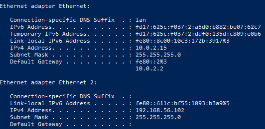
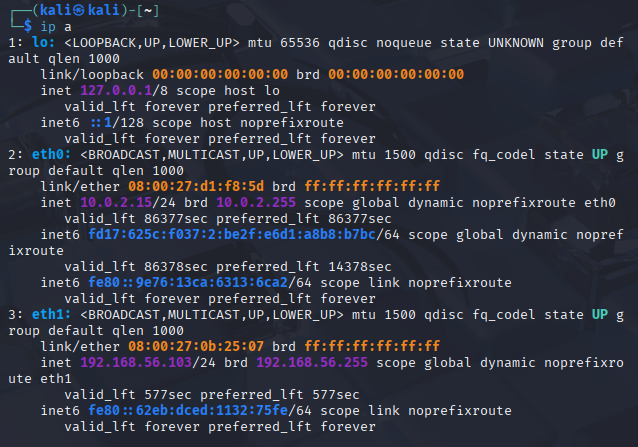
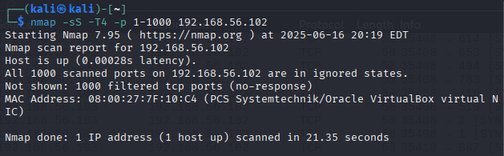
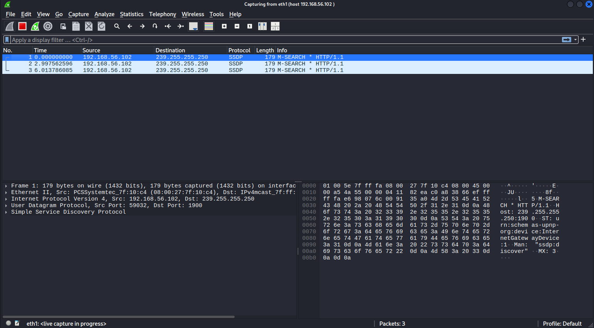
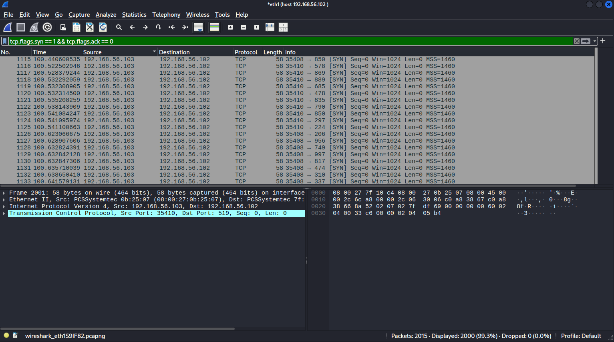

# 🔍 Wireshark TCP SYN Scan Analysis

> 🧪 This lab simulates and analyzes a basic TCP SYN scan using Nmap and Wireshark, conducted in my personal home cybersecurity lab.

---

## 🎯 Objective

To observe the packet-level behavior of a TCP SYN scan performed from Kali Linux targeting a Windows 10 VM, and analyze the traffic using Wireshark.

---

## 🧪 Lab Environment

### 🧑‍💻 Kali Linux (Attacker)
- **OS**: Kali Linux 2025.2  
- **Tools**: Nmap, Wireshark  
- **IP Address**: `192.168.56.103`

### 🖥️ Windows 10 (Target)
- **Setup**: Clean installation, default settings  
- **Firewall**: Default (enabled)  
- **IP Address**: `192.168.56.102`

### 🌐 Network Configuration
- **Kali Linux**
  - `eth0`: NAT (internet access)  
  - `eth1`: Host-Only (lab communication)
- **Windows 10**
  - Host-Only Adapter only

---

## 🛠️ Scan Command Used

```bash
nmap -sS -T4 -p 1-1000 192.168.56.102
```

- `-sS`: TCP SYN scan (stealth scan)  
- `-T4`: Aggressive timing  
- `-p 1-1000`: Scan ports 1 through 1000

---

## 📸 Screenshots

### Windows IP Configuration 
`ipconfig`


### Kali Network Interfaces 
`ip a`


### Nmap Scan Output


### Wireshark Capture Start (Optional)


### Wireshark SYN Packet Filter View



---

## 📊 Nmap Results

```text
Nmap scan report for 192.168.56.102
Host is up (0.00028s latency).
All 1000 scanned ports on 192.168.56.102 are in ignored states.
Not shown: 1000 filtered tcp ports (no-response)
```

- **No open ports** were detected.  
- **All ports appeared as filtered** — Nmap received no responses to the SYN probes.  
- The host is up and responded to Nmap's ping probe.

---

## 🔬 Wireshark Analysis

- Applied display filter:  
  'tcp.flags.syn == 1 && tcp.flags.ack == 0'  
  → Confirmed SYN packets were sent from Kali (`192.168.56.103`) to Windows (`192.168.56.102`)

- Applied response filter:  
  'ip.src == 192.168.56.102 && tcp'  
  → No packets were returned from Windows

This confirms the scan behavior reported by Nmap: the target silently dropped the packets — likely due to the default Windows firewall.

---

## ✅ Summary

This lab successfully demonstrated how a TCP SYN scan appears in Wireshark and how filtered ports manifest when a firewall silently drops packets. I observed:

- How to launch a stealthy SYN scan using Nmap  
- How to filter for SYN packets in Wireshark  
- How to detect the absence of responses (filtered ports)

This lays the groundwork for future labs, where I’ll implement endpoint logging with Sysmon, integrate with a SIEM (Wazuh), and begin building out incident detection workflows.

---


